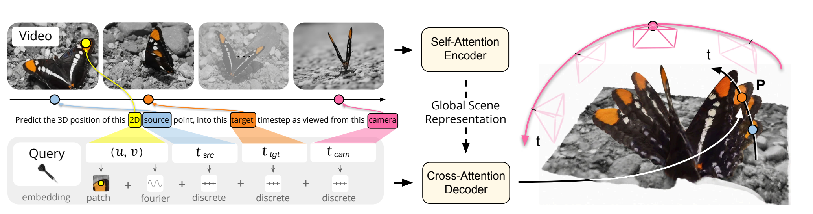
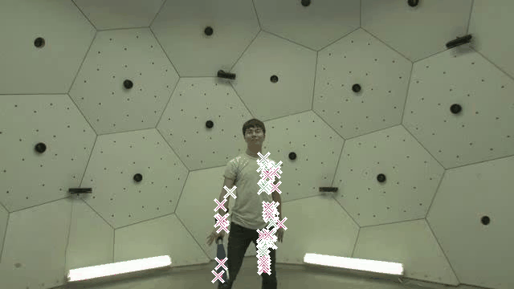
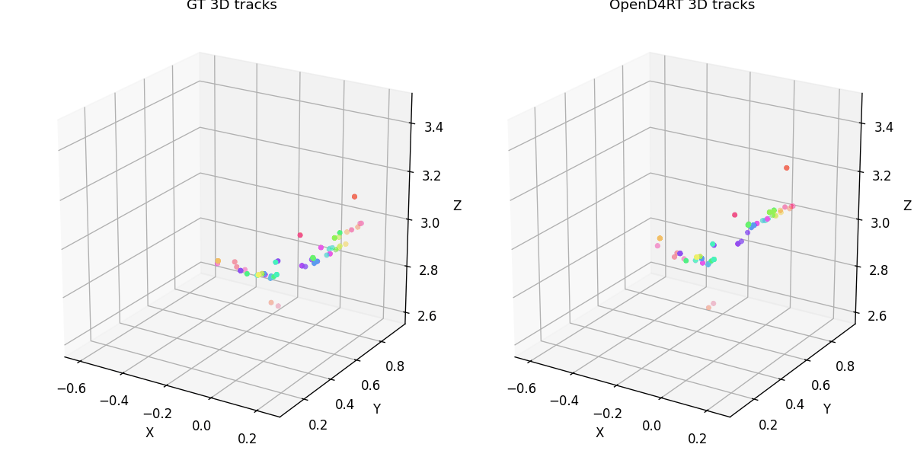
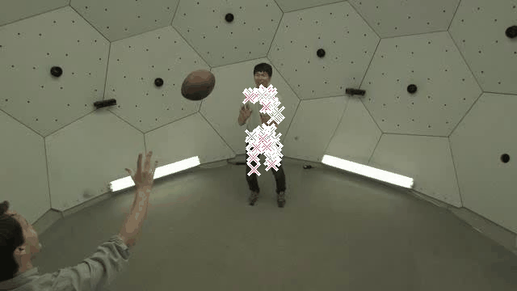
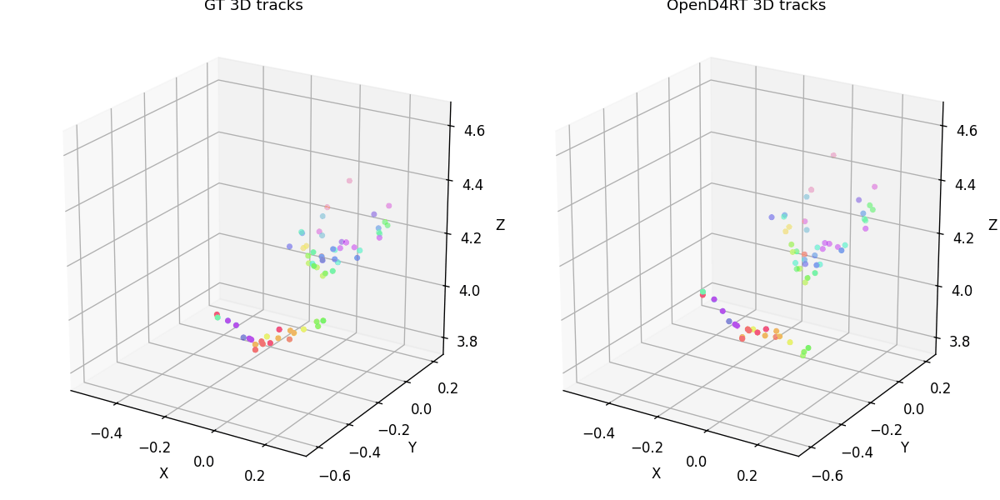

<div align="center">
  <h1>OpenD4RT</h1>
  <h3>An unofficial PyTorch/GPU implementation of D4RT for 4D reconstruction and tracking</h3>
  <p>
    <strong>RHOS Team</strong> · <a href="https://mvig-rhos.com/" target="_blank">https://mvig-rhos.com/</a>
  </p>
  <p>
    <a href="https://d4rt-paper.github.io/" target="_blank">
      
    </a>
    <a href="https://huggingface.co/Lijiaxin0111/OpenD4RT/tree/main/checkpoints" target="_blank">
      
    </a>
    <a href="LICENSE">
      
    </a>
    
    
  </p>
  <p><strong>OpenD4RT reproduces D4RT-style 4D reconstruction and tracking with released WorldTrack evaluation, visualization tools, and Hugging Face checkpoints.</strong></p>
</div>

OpenD4RT is an unofficial open-source PyTorch/GPU implementation of D4RT,
developed to reproduce the model architecture, training recipe, evaluation
protocols, and implementation details described in the D4RT paper and
appendix. The current public repo includes the released Hugging Face
checkpoint, the model, WorldTrack evaluation, and Viser visualization
tools, with complete training and evaluation code planned for release.

<p align="center">
  
</p>

## Aqua-D4RT Handoff

This repo also carries the Aqua-D4RT extension for underwater transient-aware
static reliability. The source code, configs, and claim notes are kept in the
repo; heavy results, checkpoints, and temp outputs are intentionally left out.

Start here:

- [docs/aqua_repo_handoff.md](docs/aqua_repo_handoff.md)
- [docs/aqua_icra_assessment.md](docs/aqua_icra_assessment.md)
- [docs/aqua_d4rt.md](docs/aqua_d4rt.md)

## 🔥 News

- [2026/06/04] Released the full OpenD4RT training code.
- [2025/05/20] Released the `48CLIP_9Mix_NoCropAUG` checkpoint.
- [2026/05/02] Released the OpenD4RT WorldTrack evaluation pipeline, Viser
  visualization tools, and the first Hugging Face checkpoint.

## 🧠 What is D4RT?

D4RT is a feedforward video model for reconstructing and tracking dynamic
scenes. It uses a unified transformer architecture to infer depth,
spatio-temporal correspondence, and camera parameters from a single video. Its
query interface probes the 3D position of a source pixel `(u, v, t_src)` at a
target timestep `t_tgt` in a selected camera coordinate frame `t_cam`, enabling
sparse tracking, all-pixel tracking, and 4D scene reconstruction through the
same model interface.

See [docs/D4RT_paper.pdf](docs/D4RT_paper.pdf) for the local paper PDF
included in this repository.

## 🔧 Installation

Create the conda environment:

```bash
conda env create -f environment.yml
conda activate d4rt
```

Or install into an existing Python environment:

```bash
pip install -r requirements.txt
```

The visualization package builder calls the `ffmpeg` command-line tool to
write MP4 assets for Viser. The conda environment includes `ffmpeg`; if you use
`pip install -r requirements.txt`, install `ffmpeg` separately if needed.

## 📦 Checkpoint Zoo

| Variant | Data | Aug. | Frames | Status | Download |
| --- | --- | --- | ---: | --- | --- |
| `32CLIP_9Dataset_NoAUG` | 9Mix |  color aug + No crop aug | 32 | Released | [HF](https://huggingface.co/Lijiaxin0111/OpenD4RT/tree/main/checkpoints/OpenD4RT_32CLIP_9Dataset_NoAUG) |
| `48CLIP_9Mix_NoCropAUG` | 9Mix | color aug + No crop aug  | 48 | Released | [HF](https://huggingface.co/Lijiaxin0111/OpenD4RT/tree/main/checkpoints/OpenD4RT_48CLIP_9Mix_NoCropAUG) |
| `48CLIP_9Mix_AUG` | 9Mix | color aug + crop aug | 48 | Coming | TBD |
| `32CLIP_10Mix_SynthVerse_NoAUG` | 10Mix | color aug + No crop aug | 32 | Coming | TBD |
| `48CLIP_10Mix_SynthVerse_AUG` | 10Mix |  color aug + crop aug | 48 | Coming | TBD |

Released checkpoint local path:
`checkpoints/OpenD4RT_32CLIP_9Dataset_NoAUG/opend4rt.ckpt`.

Additional released checkpoint local path:
`checkpoints/OpenD4RT_48CLIP_9Mix_NoCropAUG/opend4rt.ckpt`.

Tip: all rows are OpenD4RT variants. The 9Mix setting uses PointOdyssey,
Dynamic Replica, Kubric Full,
TartanAir, Virtual KITTI 2, ScanNet, BlendedMVS, CO3D, and MVS-Synth. The
10Mix setting additionally includes SynthVerse.

## ⬇️ Checkpoint Download

Download the released checkpoint and model config from
[Lijiaxin0111/OpenD4RT](https://huggingface.co/Lijiaxin0111/OpenD4RT/tree/main/checkpoints)
into the default path used by the scripts:

```bash
pip install -U huggingface_hub

huggingface-cli download Lijiaxin0111/OpenD4RT \
  --repo-type model \
  --include "checkpoints/OpenD4RT_32CLIP_9Dataset_NoAUG/opend4rt.ckpt" \
  --include "checkpoints/OpenD4RT_32CLIP_9Dataset_NoAUG/model.yaml" \
  --include "checkpoints/OpenD4RT_48CLIP_9Mix_NoCropAUG/opend4rt.ckpt" \
  --include "checkpoints/OpenD4RT_48CLIP_9Mix_NoCropAUG/model.yaml" \
  --local-dir .
```

Expected local files:

```text
checkpoints/OpenD4RT_32CLIP_9Dataset_NoAUG/
  opend4rt.ckpt
  model.yaml
checkpoints/OpenD4RT_48CLIP_9Mix_NoCropAUG/
  opend4rt.ckpt
  model.yaml
```

## 🌍 WorldTrack Data

Download the WorldTrack release from:

```text
https://drive.google.com/drive/folders/1-JW88ru30irMYyFab_4YBQbGbd9tKpXV
```

Place the `.npz` files under:

```text
data/worldtrack_release/
  adt_mini/*.npz
  po_mini/*.npz
  pstudio_mini/*.npz
  ds_mini/*.npz
```

## 🏋️ Training

The main reproduction entrypoint for the 48-frame 9Mix run is:

```bash
VIDEOMAE2_CKPT=/path/to/vit_g_hybrid_pt_1200e.pth \
bash scripts/train_worldtrack_sota_ninemix_clip48_a_query_local_lr4e-6_8gpu.sh
```

This script launches `torchrun`, loads the reproduction configs under
`configs/`, initializes from the released 32-frame checkpoint, and runs
the 48-frame training recipe used for the WorldTrack setting.

For a quick preflight without starting training:

```bash
DRY_RUN=1 \
VIDEOMAE2_CKPT=/path/to/vit_g_hybrid_pt_1200e.pth \
bash scripts/train_worldtrack_sota_ninemix_clip48_a_query_local_lr4e-6_8gpu.sh
```

Full training setup, required checkpoints, dataset root overrides, and smoke
test commands are documented in [docs/training.md](docs/training.md).

## 📊 Evaluation

Run a quick smoke test on one `adt_mini` sequence:

```bash
LIMIT_SEQS=1 SUBSETS=adt_mini OUTPUT_DIR=tmp/eval_smoke bash run_eval_worldtrack.sh
```

Run the full WorldTrack evaluation:

```bash
bash run_eval_worldtrack.sh
```

Equivalent explicit command:

```bash
EXP=checkpoints/OpenD4RT_32CLIP_9Dataset_NoAUG

python eval_track3d_in_worldtrack.py \
  --model-config "$EXP/model.yaml" \
  --ckpt-path "$EXP/opend4rt.ckpt" \
  --data-root data/worldtrack_release \
  --subsets adt_mini,po_mini,pstudio_mini,ds_mini \
  --num-frames 64 \
  --query-chunk-size 4096 \
  --output-dir tmp/eval_worldtrack \
  --device cuda \
  --save-per-sequence
```

Useful overrides:

```bash
QUERY_CHUNK_SIZE=1024 bash run_eval_worldtrack.sh
CUDA_VISIBLE_DEVICES=1 DEVICE=cuda bash run_eval_worldtrack.sh
SUBSETS=adt_mini LIMIT_SEQS=1 NUM_FRAMES=64 bash run_eval_worldtrack.sh
```

## 🏆 Results

OpenD4RT_32CLIP_9Dataset_NoAUG detailed WorldTrack results:

| Subset | APD global | EPE global | APD global dyn | EPE global dyn | Queries |
| --- | ---: | ---: | ---: | ---: | ---: |
| `adt_mini` | 0.6993 | 0.2964 | 0.6975 | 0.3628 | 22187 |
| `po_mini` | 0.6603 | 0.3397 | 0.7333 | 0.2722 | 53468 |
| `pstudio_mini` | 0.7863 | 0.1811 | 0.7863 | 0.1811 | 8720 |
| `ds_mini` | 0.7266 | 0.2944 | 0.7521 | 0.2699 | 52462 |

OpenD4RT_48CLIP_9Mix_NoCropAUG detailed WorldTrack results
(`step_0006000`, `anchor_clip`, evaluated with 64 frames):

| Subset | APD global | EPE global | APD global dyn | EPE global dyn | Queries |
| --- | ---: | ---: | ---: | ---: | ---: |
| `adt_mini` | 0.7220 | 0.2758 | 0.7325 | 0.3199 | 22187 |
| `po_mini` | 0.6799 | 0.3178 | 0.7425 | 0.2593 | 53468 |
| `pstudio_mini` | 0.7960 | 0.1753 | 0.7960 | 0.1753 | 8720 |
| `ds_mini` | 0.7248 | 0.2959 | 0.7488 | 0.2755 | 52462 |

## 📈 Model Results

Sparse point tracking comparison on WorldTrack-style subsets. APD is shown as
a percentage, higher APD is better, and lower EPE is better. Recent baseline
numbers are transcribed from the sparse point tracking table in the provided
reference image. OpenD4RT uses this repository's evaluation results, with
`ds_mini` reported in the DR column.

<table>
  <thead>
    <tr>
      <th rowspan="2" align="left">Model</th>
      <th colspan="2" align="center">PStudio</th>
      <th colspan="2" align="center">PO</th>
      <th colspan="2" align="center">DR</th>
      <th colspan="2" align="center">ADT</th>
    </tr>
    <tr>
      <th align="right">APD&nbsp;↑</th><th align="right">EPE&nbsp;↓</th>
      <th align="right">APD&nbsp;↑</th><th align="right">EPE&nbsp;↓</th>
      <th align="right">APD&nbsp;↑</th><th align="right">EPE&nbsp;↓</th>
      <th align="right">APD&nbsp;↑</th><th align="right">EPE&nbsp;↓</th>
    </tr>
  </thead>
  <tbody>
    <tr><td><b>SpaTrackerV2</b> (2025)</td><td align="right">74.16</td><td align="right">0.2272</td><td align="right">69.57</td><td align="right">0.3780</td><td align="right">73.43</td><td align="right">0.2732</td><td align="right">92.22</td><td align="right">0.0915</td></tr>
    <tr><td><b>St4RTrack</b> (2025)</td><td align="right">69.67</td><td align="right">0.2637</td><td align="right">67.95</td><td align="right">0.3140</td><td align="right">73.74</td><td align="right">0.2682</td><td align="right">76.01</td><td align="right">0.2680</td></tr>
    <tr><td><b>TraceAnything</b> (2025)</td><td align="right">71.33</td><td align="right">0.2727</td><td align="right">39.83</td><td align="right">1.0593</td><td align="right">60.63</td><td align="right">0.5758</td><td align="right">75.65</td><td align="right">0.2511</td></tr>
    <tr><td><b>Any4D</b> (2025)</td><td align="right">60.03</td><td align="right">0.3344</td><td align="right">60.86</td><td align="right">0.4194</td><td align="right">68.39</td><td align="right">0.3012</td><td align="right">56.71</td><td align="right">0.4320</td></tr>
    <tr><td><b>V-DPM</b> (2026)</td><td align="right">76.36</td><td align="right">0.1957</td><td align="right">79.79</td><td align="right">0.1994</td><td align="right">76.38</td><td align="right">0.2378</td><td align="right">66.06</td><td align="right">0.3426</td></tr>
    <tr><td><b>4RC</b>(2026)</td><td align="right">69.04</td><td align="right">0.2603</td><td align="right">80.27</td><td align="right">0.2681</td><td align="right">82.91</td><td align="right">0.1889</td><td align="right">84.28</td><td align="right">0.1766</td></tr>
    <tr>
      <td><b>OpenD4RT 32CLIP (Ours)</b></td>
      <td align="right"><b>78.63</b></td>
      <td align="right"><b>0.1811</b></td>
      <td align="right"><b>66.03</b></td><td align="right"><b>0.3397</b></td>
      <td align="right"><b>72.66</b></td><td align="right"><b>0.2944</b></td>
      <td align="right"><b>69.93</b></td><td align="right"><b>0.2964</b></td>
    </tr>
    <tr>
      <td><b>OpenD4RT 48CLIP (Ours)</b></td>
      <td align="right"><b>79.60</b></td>
      <td align="right"><b>0.1753</b></td>
      <td align="right"><b>67.99</b></td><td align="right"><b>0.3178</b></td>
      <td align="right"><b>72.48</b></td><td align="right"><b>0.2959</b></td>
      <td align="right"><b>72.20</b></td><td align="right"><b>0.2758</b></td>
    </tr>
  </tbody>
</table>

Tip: OpenD4RT has the strongest PStudio result in this comparison.

## 🎬 Result Gallery

| Case / Motion | RGB + 2D Tracking | GT vs Pred 3D Tracks |
| --- | --- | --- |
| `softball_25`<br>Softball swing and fast ball motion |  |  |
| `football_16`<br>Football play with player and ball motion |  |  |

## 👁️ Viser Demo Visualization

Build two example Viser demo packages. Each package uses the first 64 frames:

```bash
DEMO_CASE=pstudio_mini/juggle_5.npz OUTPUT_DIR=tmp/worldtrack_demo_juggle bash run_build_worldtrack_demo.sh
DEMO_CASE=pstudio_mini/softball_25.npz OUTPUT_DIR=tmp/worldtrack_demo_softball bash run_build_worldtrack_demo.sh
```

Open a demo package with Viser:

```bash
python vis/serve_demo_viser.py --root tmp/worldtrack_demo_juggle --port 8081
```

For a lighter/faster package:

```bash
DEMO_CASE=pstudio_mini/juggle_5.npz \
OUTPUT_DIR=tmp/worldtrack_demo_small \
POINT_GRID_COLS=32 POINT_GRID_ROWS=32 POINT_MAX_POINTS=1024 TRACK_MAX_POINTS=96 \
bash run_build_worldtrack_demo.sh
```

The generated demo package contains `assets/demo_data.json`,
`assets/input_video.mp4`, rendered diagnostic videos, and `manifest.json`.

## ✅ ToDo

- [x] Release the OpenD4RT model runtime for the 32-frame 9-dataset checkpoint.
- [x] Release WorldTrack evaluation scripts and archived metrics.
- [x] Release Viser-based qualitative visualization tools.
- [x] Release complete training code.
- [ ] Release additional checkpoints listed in the Checkpoint Zoo.
- [ ] Release SynthVerse evaluation results.
- [ ] Release full evaluation code for the benchmarks reported in the D4RT
  paper and appendix.

## 📄 License

OpenD4RT is an unofficial implementation and is not affiliated with or endorsed
by the original D4RT authors. The code in this repository is released under the
Apache 2.0 license; see [LICENSE](LICENSE). The D4RT paper, project page,
datasets, third-party assets, and upstream dependencies remain under their
respective licenses and terms.

## 🙏 Acknowledgements

This project is built upon the D4RT paper and official project materials. We
thank the original D4RT authors for introducing the D4RT formulation, releasing
the project page, and documenting the paper and appendix details that this
implementation follows. We also acknowledge the contributors and resources
credited on the official D4RT website, including colleagues who supported
project advice, manuscript feedback, early development, code review,
visualization, baseline comparisons, and data generation. We also thank the
splat viewer authors for the WebGL renderer used by the official D4RT
visualization pipeline. Please refer to the official D4RT project page for the
full original acknowledgements.
